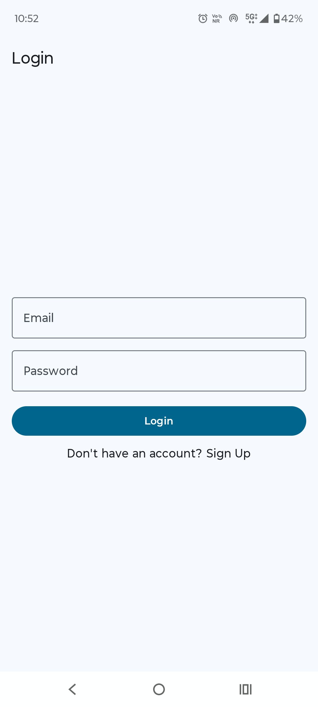
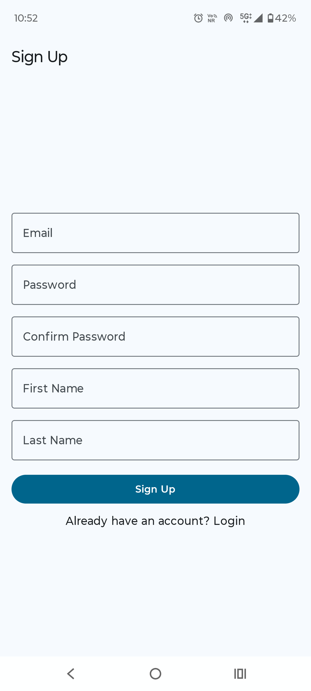
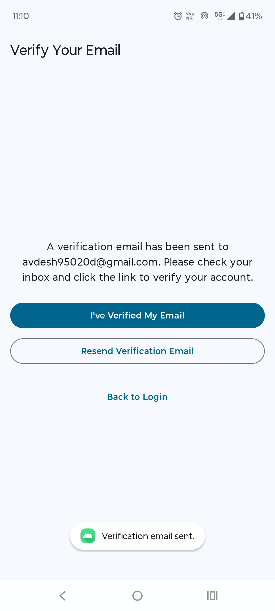
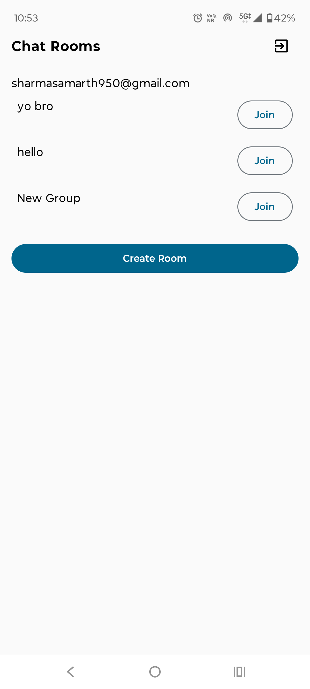
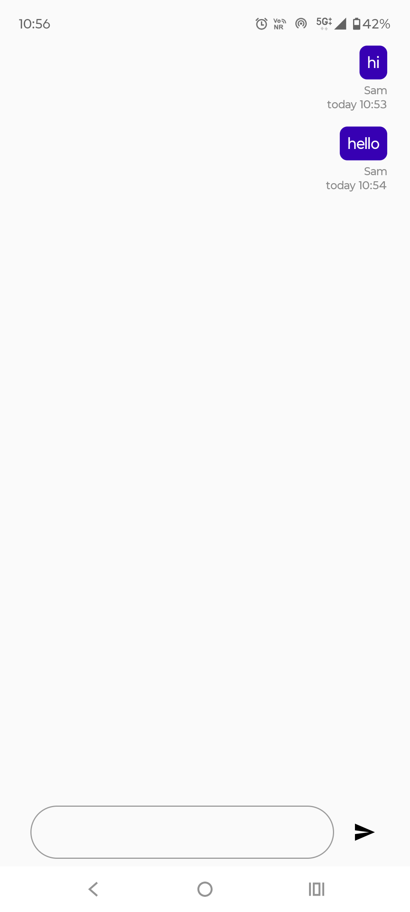

# ChatRoom App

ChatRoom App is a real-time messaging application built with Kotlin and Jetpack Compose. It uses Firebase Authentication and Firestore for secure login and seamless group conversations.
With a clean MVVM architecture, and Material 3 design, the app offers a modern, scalable, and user-friendly chat experience.

---

## Features

-  User Authentication – Secure sign-up and login using Firebase Authentication
-  Real-time Messaging – Instant group chat powered by Firestore
-  MVVM Architecture – Clean separation of concerns for scalability
-  Beautiful UI using Jetpack Compose + Material 3

---

## Tech Stack

| Layer        | Tools                                         |
|--------------|-----------------------------------------------|
| UI           | Jetpack Compose, Material 3                   |
| Presentation | MVVM, ViewModel, StateFlow                    |
| Domain       | Models, Repository Interface                  |
| Data         | Firestore database, Repository Implementation |
| Language     | Kotlin                                        |

---

## Screenshots

> Example:
> ### Login Screen

<p align="center">
  
</p>

### Sign Up Screen

<p align="center">
  
</p>

### Verification Screen

<p align="center">
  
</p>

### Home Screen

<p align="center">
  
</p>

### Chat Screen

<p align="center">
  
</p>

---

## Future Enhancements

-  Push Notifications – Notify users of new messages in real time
-  Media Sharing – Send images, videos, and files in chat
-  Private Messaging – One-on-one chat in addition to group conversations
-  Online/Offline Presence – Show active users with status indicators
-  User Mentions & Tags – Mention users in group conversations
-  End-to-End Encryption – Enhance privacy and data security

---
## Download

[⬇️ Download APK](https://drive.google.com/file/d/133s2bzId-9FUmyEb5ISOdW-dcQmMJC85/view?usp=sharing)

## Getting Started

1. **Clone the repo**
```bash
git clone https://github.com/S4marthX/ChatRooms.git